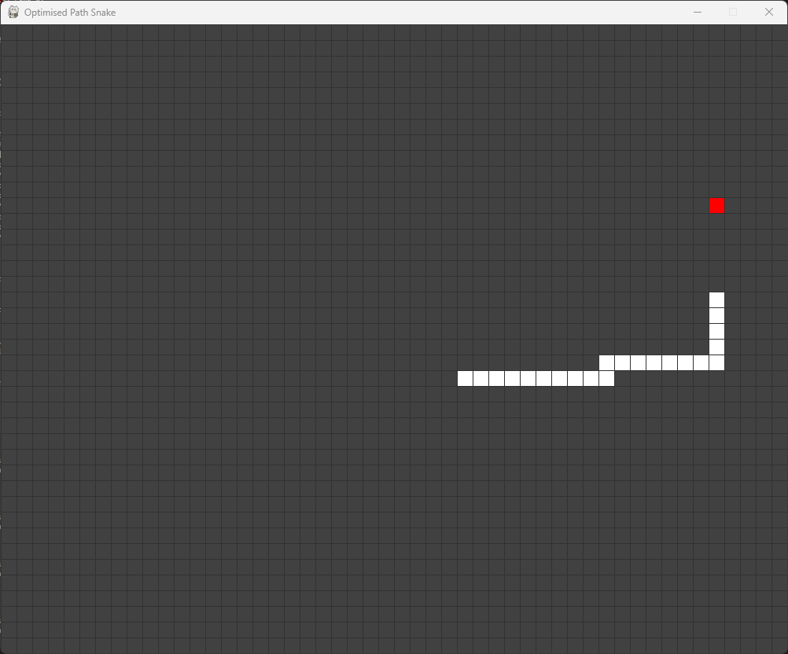

# snAIke
sn**AI**ke is a repository with automated versions of the game Snake.

## Optimised
The code in this folder contains a version of Snake that plays itself following the shortest path between the Snake's head and the food, which is calculated using the A* algorithm.
This isn't entirely flawless, but it's good enough as a proof of concept.

## AI
This part of the repository is yet to be implemented.

## Running the code
Check the requirements.txt file to see all necessary dependencies.
### Optimised / A* version
To run this version of the game, just run the game.py file.